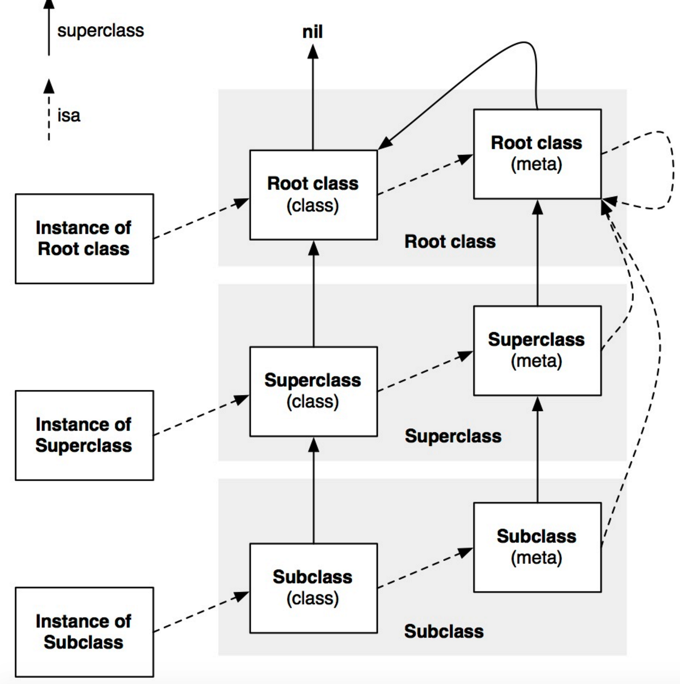

# Objective- C

## Foundation

### 堆栈（系统）

* 栈：由系统自动分配，一般存放函数参数值，局部变量值等，由编译器自动创建和释放，操作方式类似数据结构中的栈，遵循先进后出原则；

* 堆：一般由程序员申请并指明大小，最终也由程序员释放。如果程序员不释放，程序结束时可能会由OS回收。对于堆区的管理是采用链表式管理的，操作系统有一个记录空闲内存地址的链表，当接收到程序分配内存的申请时，操作系统就会遍历该链表，遍历到一个记录的内存地址大于申请内存的链表节点，并将该节点从该链表中删除，然后将该节点记录的内存地址分配给程序；

* 全局区/静态区：顾名思义，全局变量和静态变量存储在这个区域。只不过初始化的全局变量和静态变量存储在一块，未初始化的全局变量和静态变量存储在一块。程序结束后由系统释放；

* 文字常量区：这个区域主要存储字符串常量。程序结束后由系统释放；

* 程序代码区：这个区域主要存放函数体的二进制代码。

### Runtime

* [objc_msgSend](http://gold.xitu.io/post/57a9516e7db2a2005aba4809)



* [Method Swizzling](http://gold.xitu.io/post/57aae1658ac247005f4da511)

当使用`Method Swizzling`时，如下代码中调用`[self swizzed_method]`相当于调用替换之前的`[self method]`

```
- (void)swizzed_method {
  [self swizzed_method];
}
```

Objective-C中集合类簇实际对应的对象类型。

| 类                   |      对应的类簇      |
| :------------------ | :-------------: |
| NSArray             |   __NSArrayI    |
| NSMutableArray      |   __NSArrayM    |
| NSDictionary        | __NSDictionaryI |
| NSMutableDictionary | __NSDictionaryM |

### block

#### 定义

```
int (^multiBlock) (int) = ^(int intVar) {
  return intVar * 2;
}
```

#### block中使用变量

在block中直接使用局部变量相当于copy一份到block内部，block不能更改变量的值，也不能实时监测到变量值的改变，除非该变量为全局变量或者给该变量加上`__block`标记.

#### block的递归调用

sblock要递归调用，block本身必须是全局变量或者是静态常量：

```
static void(^ const block)(int) = ^(int i) {
  if (i > 0) {
    NSLog(@"%d",i);
    block(i - 1);
  }
}
block(4);
```

### ARC

* 只要一个对象被任意strong指针指向，那么他将不会被摧毁，如果对象没有strong指针指向，那没就会被摧毁；

* 若一个对象没有指向它的strong指针，所有指向该对象的weak指针将被置为nil，避免EXC_BAD_ACCESS;

### shadowCopy && deepCopy

#### 定义

* 浅拷贝：只是复制容器本身，不会复制容器内部的元素，浅拷贝后生成的新容器对象和原始容器对象共享内部元素；

* 深拷贝：不仅复制容器本身，容器内部的元素也会复制，深拷贝后生成的新容器对象和原始容器的内部元素是独立的；

#### copy && mutableCopy

* 使用mutableCopy拷贝出的对象都会与被拷贝对象指向不同对象；使用copy拷贝出的对象若被拷贝对象是不可变对象，则指向同一对象，若被拷贝对象为不可变对象，则指向不同对象。

* 对于集合类对象，使用mutableCopy，copy操作都是浅拷贝，即使拷贝出的对象内存地址不同，但集合内部元素内存地址相同。

* 使用`initWithArray: copyItems:`拷贝出的对象只能实现单层深复制，完全深复制可以使用归档和解档：
```
copyArray = [NSKeyedUnarchiver unarchiveObjectWithData:[NSKeyedArchiver archivedDataWithRootObject:array]];
```

* 可变对象属性用copy修饰，当该对象调用setter方法赋值时，实际会先调用copy生成不可变对象，然后再赋值给该属性，该变量实际会变成不可变对象，调用可变对象方法会crash。

### Equality
``
一个`isEqual`的判断示例:

```
- (BOOL)isEqual:(id)object {
  if (self == object) {
    return YES;
  }
  if (![object isKindOfClass:[NSArray class]]) {
    return NO;
  }
  return [self isEqualToArray:(NSArray *)object];
}
```

* `isEqual`的判定结果与`hash`无关;

* 对于`NSArray`对象，只要其子项满足`isEqualToString`，`isEqualToDictionary`等值比较，`isEqual`返回YES;同时`NSArray`的`containsObject:(id)object`判断的结果由与object`isEqual`的返回值决定；
* 对于`NSMutableArray`对象，调用`removeObject:(id)object`，一旦子项中的对象与object`isEqual`返回YES，该子项将被移除。

由于`字符串驻留`优化技术，** 所有静态定义的不可变字符串对象 ** ，如果字符串相同，那么这些对象都指向同一个驻留字符串值。

```
NSString *a = @"Hello";
NSString *b = @"Hello";
BOOL wtf = (a == b); // YES
```

### weakSelf && strongSelf

```
[UIView animateWithDuration:0.2 animations:^{
    self.myView.alpha = 1.0;
}];
```
block执行期间self 不会被摧毁，不需要使用weakSelf，strongSelf；

```
__weak __typeof__(self) weakSelf = self;
    dispatch_async(dispatch_get_global_queue(DISPATCH_QUEUE_PRIORITY_DEFAULT, 0), ^{
    [weakSelf doSomething];
    [weakSelf doOtherThing];
});
```
block执行结束期间self是否被销毁为知，使用weakSelf可避免self，block循环引用，造成内存泄露，使用strongSelf可保证在block内部，self不会为nil；

### 泛型

#### 定义

泛型可用于制定容器中对象的类型：

```
NSArray<NSString *> *strings = @[@"sun", @"yuan"];
NSDictionary<NSString *, NSNumber *> *mapping = @{@"a": @1, @"b": @2};
```

#### 协变性和逆变性（似乎只能在自定义泛型中使用）

不指定类型的容器可以喝任意泛型类型转化，但指定泛型类型之后，两个不同类型之间不能强转，需要通过`__covariant`,`__contravariant`修饰；

* `__covariant` - 协变性，子类型可以强转到父类型（里氏替换原则）eg: `NSArray <NSString *>` 类型的对象赋值给 `NSArray`

* `__contravariant` - 逆变性，父类型可以强转到子类型（WTF?）eg:将一个`NSArray` 的对象赋值给`NSArray<NSNumber > *` 对象


### 类型检查

`__kindof`相对于`id`更加具体的制定了对象的类型：

```
@property (nonatomic, readonly, copy) NSArray<__kindof UIView *> *subviews;
```

在调用时也不需要强转类型，同时也不会有编译警告：

```
UIButton *button = [view.subviews lastObject];
```

### isKindOfClass && isMemberOfClass

* isMemberOfClass 判断是否是某个类的成员;

* isKindOfClass 判断是否是某个类或其子类的成员;

## API Reference

### Navigation Bar

#### 修改UIStatusBarStyle

IOS 7 OR LATER

*   info.plist 设置`UIViewControllerBasedStatusBarAppearance`为YES；

*   在UIViewController中重写`preferredStatusBarStyle`,并在需要改变`UIStatusBarStyle`时调用`[self setNeedsStatusBarAppearanceUpdate];`

*   在UINavigationController重写`preferredStatusBarStyle`方法，返回topViewController的UIStatusBarStyle。

          ​```
          (UIStatusBarStyle)preferredStatusBarStyle {
          
            UIViewController *viewController = self.topViewController;
          
            return [viewController preferredStatusBarStyle];
          
          }
          ​```

BEFORE IOS7

* info.plist 设置`UIViewControllerBasedStatusBarAppearance`为NO；

* 直接调用`[UIApplication sharedApplication].statusBarStyle = UIStatusBarStyleDefault`修改statusBarStyle。

#### UINavigationBar属性

* `edgesForExtendedLayout`设置ViewController延伸的枚举，默认`UIRectEdgeAll`，ViewController视图会延伸到`UINavigationBar`和`UITabBar`，`UIRectEdgeNone`则不会延伸。

* `automaticallyAdjustsScrollViewInsets`默认YES,视图初始状态从`UINavigationBar`下面开始，从`UITabBar`顶部结束，当`edgesForExtendedLayout`属性设置为`UIRectEdgeAll`时，视图可以穿透`UINavigationBar`和`UITabBar`，作用相当于自动设置了contentInsets。

* `extendedLayoutIncludesOpaqueBars`属性是对`edgesForExtendedLayout`的补充，当** NavigationBar、TabBar、TooBar 不透明** 时 ，设置为YES，视图任将扩展到不透明区域，设置为NO，则不会扩展到不透明区域。

* `modalPresentationCapturesStatusBarAppearance`控制在present一个viewController时，是否由被present的viewController控制statusBarStyle，默认为NO。

#### 自定义UINavigationBar样式


* 设置阴影线条image

    ```
  // 隐藏阴影黑线
  [self.navigationController.navigationBar setShadowImage:[[UIImage alloc] init]];
  // 显示阴影黑线
  [self.navigationController.navigationBar setShadowImage:nil];
    ```

* 设置背景图片

    ```
    [self.navigationController.navigationBar setBackgroundImage:[[UIImage alloc] init] forBarPosition:UIBarPositionAny barMetrics:UIBarMetricsDefault];
    ```

## Tips

### 宏与静态常量

#### 定义常量

```
.h //
extern NSString * const kConstExternFoo;
.m //
NSString * const kConstExternFoo = @"ConstExternFoo";
```

#### static全局变量 & static局部变量

* 局部变量:static修饰的局部变量延长了该变量的生命周期,任然只能局部访问，但当再次调用该局部区域（函数）时，该变量存储的是上次调用该局部区域的值，相当于只能“局部访问”的全局变量；

* 全局变量:static修饰的全局变量限制了该变量只能在该文件中访问。
