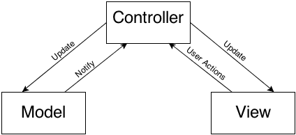

# Design Pattern

> [iOS 设计模式之旅](https://github.com/skyming/Trip-to-iOS-Design-Patterns)

> [MVC,MVP,MMVM,VIPER设计模式区别](http://www.jianshu.com/p/b849c6972216)

> [MVC,MVP,MMVM图示](http://www.ruanyifeng.com/blog/2015/02/mvcmvp_mvvm.html)

在软件设计领域，设计模式是对通用问题的可复用的解决方案。设计模式是一系列帮你写出更可理解和复用代码的模板，设计模式帮你创建松耦合的代码以便你不需要费多大力就可以改变或者替换代码中的组件。

## MVC模式
理想状态下的`MVC`结构：



模型会把任何数据的变更通知控制器，然后控制器更新视图数据。视图对象通知控制器用户的操作，控制器要么根据需要来更新模型，要么检索任何被请求的数据。

`Model`: 模型保存应用程序的数据，定义了怎么去操作它;

`View`: 视图是模型的可视化表示以及用户交互的控件；基本上来说，所有的UIView对象以及它的子类都属于视图;

`Controller`: 控制器是一个协调所有工作的中介者（Mediator）。它访问模型中的数据并在视图中展示它们，同时它们还监听事件和根据需要操作数据;

实际中`Model`和`View`容易耦合在一起，并且`Controller`非常臃肿，不利于但愿测试。

## MVP模式


`MVP`模式将`Controller`变为`Presenter`,同时各组件之间的通信方向发生改变。

- 各部分之间的通信，都是双向的。
- View 与 Model 不发生联系，都通过 Presenter 传递。
- View不参与任何逻辑，称为`被动视图`(Passive View),而所有逻辑都放在了Presenter中
- 相对于`MVC`模式开发速度会降低，但是View和Model不再耦合，结构更清晰，利于单元测试。

## MMVM模式


## 单例模式

单例模式确保一个类只有一个实例存在，并且该实例可以全局访问。

Objective-C中的单例实现：

```
+ (ShareClass *)sharedInstance {
    static ShareClass *_share = nil;
    static dispatch_once_t onceToken;
    dispatch_once(&onceToken, ^{
        _share = [[self alloc] init];
    });
    return _share;
}
```

Swift中的单例实现：

```
class ShareClass {
    public static let shared : ShareClass = ShareClass()
    private init() {}
}
```

## 外观(Facade)模式

`外观模式`将细节封装起来，多个类实现的功能只暴露单一的接口，降低了用户对内部细节的依赖性，当内部实现细节发生变化时，`外观模式`保持原样的接口，降低了项目的维护难度。
