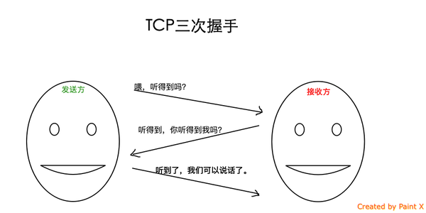
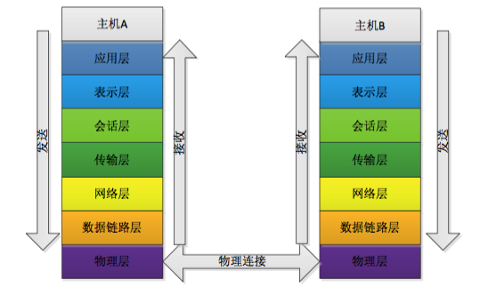

# Network

> [HTTP面试基础](https://hit-alibaba.github.io/interview/basic/network/HTTP.html)

> [TCP连接的三次握手与四次分手](http://www.jellythink.com/archives/705)

> [计算机网络结构](http://www.jianshu.com/p/4b9d43c0571a)

## HTTP

- HTTP构建于TCP/IP协议之上，默认端口号是80
- HTTP是无连接无状态的

## 概念

HTTP 协议是以 ASCII 码传输，建立在 TCP/IP 协议之上的应用层规范。

## HTTP请求与响应

HTTP 请求由三部分组成：
- 请求行
- 请求头
- 请求正文

```
// 请求行
POST /index.php HTTP/1.1

// 请求头
Host: localhost
User-Agent: Mozilla/5.0 (Windows NT 5.1; rv:10.0.2) Gecko/20100101 Firefox/10.0.2
Accept: text/html,application/xhtml+xml,application/xml;q=0.9,*/*;q=0.8
Accept-Language: zh-cn,zh;q=0.5
Accept-Encoding: gzip, deflate
Connection: keep-alive
Referer: http://localhost/
Content-Length：25
Content-Type：application/x-www-form-urlencoded

// 请求正文
username=aa&password=1234
```

HTTP响应也由3个部分构成，分别是：
- 状态行
- 响应头(Response Header)
- 响应正文

```
// 响应行
HTTP/1.1 200 OK

// 响应头
Server:Apache Tomcat/5.0.12
Date:Mon,6Oct2003 13:23:42 GMT
Content-Length:112

// 响应正文
<html>...

```

### 响应状态码

响应码可根据第一位数字分五类表示：

- 1xx：信息，请求收到，继续处理
- 2xx：成功，行为被成功地接受、理解和采纳
- 3xx：重定向，为了完成请求，必须进一步执行的动作
- 4xx：客户端错误，请求包含语法错误或者请求无法实现
- 5xx：服务器错误，服务器不能实现一种明显无效的请求

几个常用状态码示意：

Code |    Descriptions
:----------- | :-------------:
200 | OK 客户端请求成功
301 | Moved Permanently 请求永久重定向
302 | Moved Temporarily 请求临时重定向
304 |Not Modified 文件未修改，可以直接使用缓存的文件。
400 | Bad Request 由于客户端请求有语法错误，不能被服务器所理解。
401 | Unauthorized 请求未经授权。这个状态代码必须和WWW-Authenticate报头域一起使用
403 | Forbidden 服务器收到请求，但是拒绝提供服务。服务器通常会在响应正文中给出不提供服务的原因
404 | Not Found 请求的资源不存在，例如，输入了错误的URL
500 | Internal Server Error 服务器发生不可预期的错误，导致无法完成客户端的请求。
503 | Service Unavailable 服务器当前不能够处理客户端的请求，在一段时间之后，服务器可能会恢复正常。

## 交互方式

HTTP定义了`GET`，`POST`，`PUT`，`DELETE`四种最基本的与服务器交互方式，`URL`全称为统一资源定位符，用于描述网络上的一个资源，可以认为而 HTTP 中的`GET`，`POST`，`PUT`，`DELETE`就对应着对这个资源的查，改，增，删4个操作。

`GET`与`POST`请求的区别:
- `GET`请求将请求数据放在URL里，和`POST`则将请求数据放在请求主体中；
- 虽然HTTP没有对请求数据大小做限制，但`GET`请求实际会受到浏览器URL输入长度限制，而`POST`请求理论上不受限制；
- `POST`请求相对于`GET`请求相对安全

其他交互方式：

Method |  Descriptions
:----------- | :-------------:
HEAD |	与 GET 相同，但只返回 HTTP 报头，不返回文档主体。
OPTIONS |	返回服务器支持的 HTTP 方法。
CONNECT |	把请求连接转换到透明的 TCP/IP 通道。

## TCP

- TCP提供一种面向连接的、可靠的字节流服务
在一个TCP连接中，仅有两方进行彼此通信。广播和多播不能用于TCP
- TCP使用校验和，确认和重传机制来保证可靠传输
- TCP使用累积确认
- TCP使用滑动窗口机制来实现流量控制，通过动态改变窗口的大小进行拥塞控制

### 三次握手

- 第一次握手：建立连接。客户端发送连接请求报文段，将`SYN`位置为1，`Sequence Number`为x；然后，客户端进入`SYN_SEND`状态，等待服务器的确认；
- 第二次握手：服务器收到`SYN`报文段。服务器收到客户端的`SYN`报文段，需要对这个`SYN`报文段进行确认，设置`Acknowledgment Number`为x+1(`Sequence Number`+1)；同时，自己自己还要发送`SYN`请求信息，将`SYN`位置为1，`Sequence Number`为y；服务器端将上述所有信息放到一个报文段（即`SYN`+`ACK`报文段）中，一并发送给客户端，此时服务器进入`SYN_RECV`状态；
- 第三次握手：客户端收到服务器的`SYN`+`ACK`报文段。然后将`Acknowledgment Number`设置为y+1，向服务器发送`ACK`报文段，这个报文段发送完毕以后，客户端和服务器端都进入ESTABLISHED状态，完成TCP三次握手。



### 四次分手

- 第一次分手：主机1（可以使客户端，也可以是服务器端），设置`Sequence Number`和`Acknowledgment Number`，向主机2发送一个FIN报文段；此时，主机1进入FIN_WAIT_1状态；这表示主机1没有数据要发送给主机2了；
- 第二次分手：主机2收到了主机1发送的FIN报文段，向主机1回一个`ACK`报文段，`Acknowledgment Number`为`Sequence Number`加1；主机1进入FIN_WAIT_2状态；主机2告诉主机1，我“同意”你的关闭请求；
- 第三次分手：主机2向主机1发送FIN报文段，请求关闭连接，同时主机2进入`LAST_ACK`状态；
- 第四次分手：主机1收到主机2发送的FIN报文段，向主机2发送`ACK`报文段，然后主机1进入`TIME_WAIT`状态；主机2收到主机1的`ACK`报文段以后，就关闭连接；此时，主机1等待2MSL后依然没有收到回复，则证明Server端已正常关闭，那好，主机1也可以关闭连接了。

## 网络结构

### OSI结构



### TCP/IP结构


