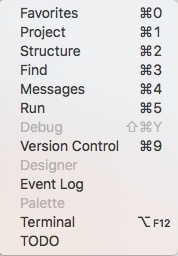

# AppCode

## Keymap
| descriptions        |         ShortCut         |
| :------------------ | :----------------------: |
| override method     |      cmd + opt + o       |
| find useage         |      cmd + opt + F7      |
| next/previous error | cmd + ' /cmd + shift + ' |
| evaluate symbols    |         alt + F8         |
| next method         |         alt + up         |
| 多选                  |       alt + shift        |
| 选择当前单词下次出现的位置 | ctrl + G



## vmoptions

AppCode默认.vmoptions文件在~/Application/AppCode/bin/AppCode.vmoptions,更改该文件会改变AppCode的文件签名，应当使用`Help-Edit Custom VM Options`来更改配置：
```
# custom AppCode VM options
-Xss2m
-Xms256m
-Xmx4096m
-XX:NewSize=128m
-XX:MaxNewSize=256m
-XX:ReservedCodeCacheSize=192m
-XX:+UseCompressedOops
```
# Shell

```
chmod + x ass.file //设置文件权限
mv ass.file filename //更改文件名  
```

# Atom

| descriptions        |         ShortCut         |
| :------------------ | :----------------------: |
| console             |  cmd + shift + p         |
| list project        |  cmd + ctl  + l          |


# Xcode

## Xcode 警告

### 开启可信度较高的警告

Build Setting -> other c flags -> `-Wall`

### 开启大部分警告

Build Setting -> other c flags -> `-Wextra`

## 环境变量

Edit Scheme -> Arguments -> Environment Variables

# Git

git config --global user.name "聂锐"

git config --global user.email nic.reals@outlook.com

sudo spctl --master-disable //关闭gatekeeper

# Fish Shell

## 安装OMF

```
curl -L github.com/oh-my-fish/oh-my-fish/raw/master/bin/install | fish
omf help
omf install pure
omf theme pure
```

## 安装rvm

```
omf install rvm
rvm install x.x
rvm use x.x
```
