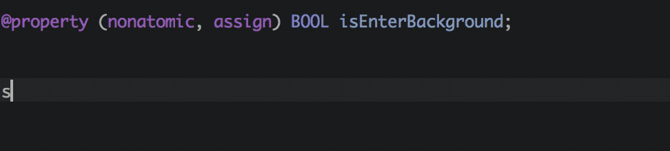
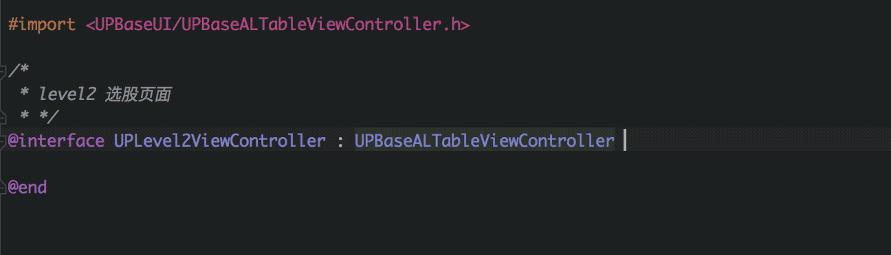
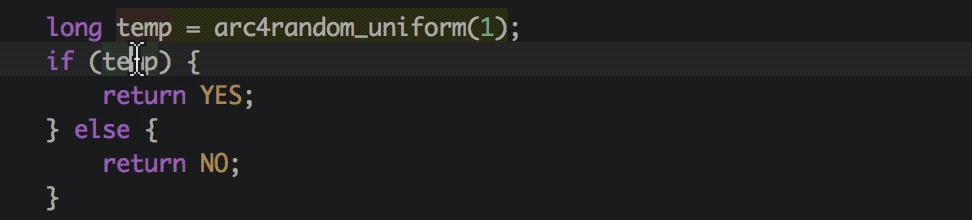
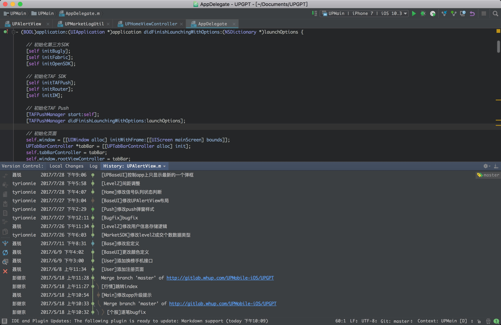

# AppCode

> Xcode傻逼的次数 = 代码行数 / 50 😢

## Compare

用 Xcode 就像便秘一样，拉不出来，即便拉出来了，夹不断的辣种感觉。
Xcode大概是这样:


*也不是没有优点，至少人家免费。*

vim大概这样:


*听说传说中牛逼的程序员vim在手，完全不用IDE，可惜我没见过*

还好我们有喷脑浆(jetBrain)出的AppCode,大概这样:


*如果AppCode用的溜，同理喷脑浆其他的产品，大概是这样*:


## Advantage

### Crash


懂的人都懂

### Refactor

编码过程中不可避免要对代码进行重构，以最简单的改变量名称为例:


### Code Completion

能根据上下文和个人使用习惯匹配的代码提示，用过的都知道。
顺便讲个笑话，Xcode之前的版本代码提示必须从左到右逐一打出来才能不匹配。



### Auto Import

就算没有import的类，编码过程中，AppCode依然能匹配改类，并且在选中后自动import改类，完全不会被文件引用的问题打断思路。
并且如果是在头文件的化，会默认使用`@import`而不是`#import`,简直是强迫症的福音。



### Live Template

类似于Xcode的snippet，但是功能比snippet可玩性和实用性上好很多，
例如输入`logv`可以根据上下文判断需要log的变量，并且自动匹配变量说明符,
感受下:


### Load Resource

例如最常见的`imageNamed` 加载图片:


### Code Inspection

AppCode会实时检测代码中不合理的地方，并给出合理的改进方案:



### Customize

AppCode除了可以定制代码配色，文件布局，甚至可以自定义代码风格，假如你喜欢这样的`{}`的换行方式:

  ```
  - (void)test
  {

  }
  ```

  那么指定后，AppCode会自动在你输入`{}`是将其格式化成如上形式

### Version Control

几乎Git 客户端有的功能AppCode都有，而且还挺好用

## Bazinga

颜值即是第一生产力:


